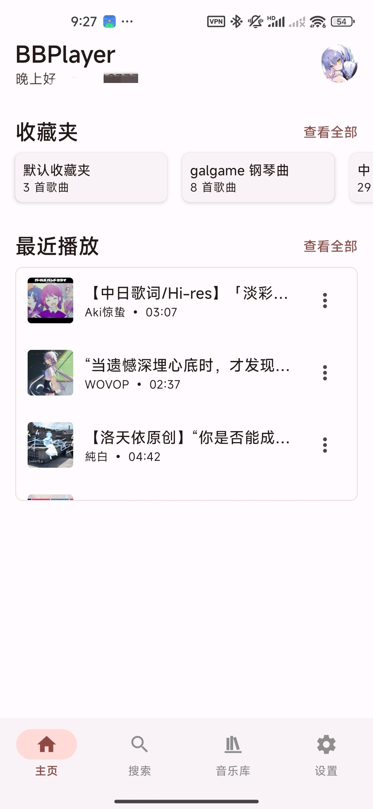
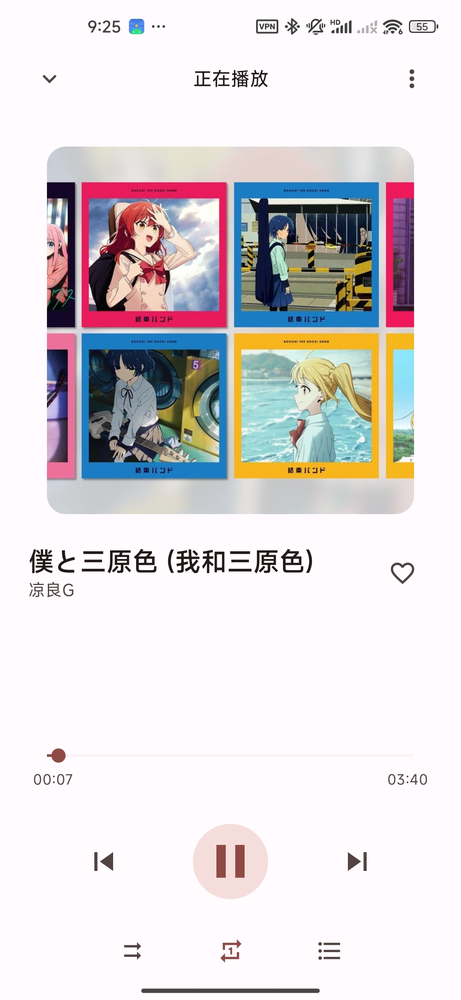
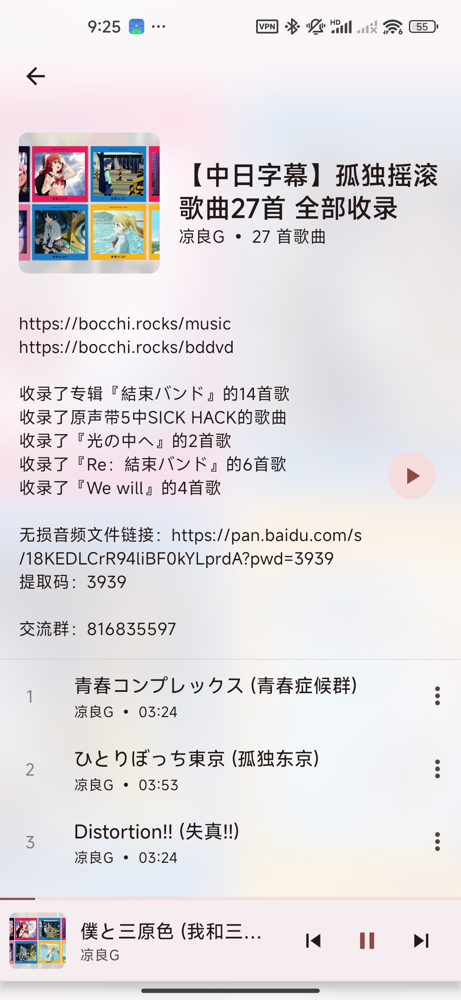
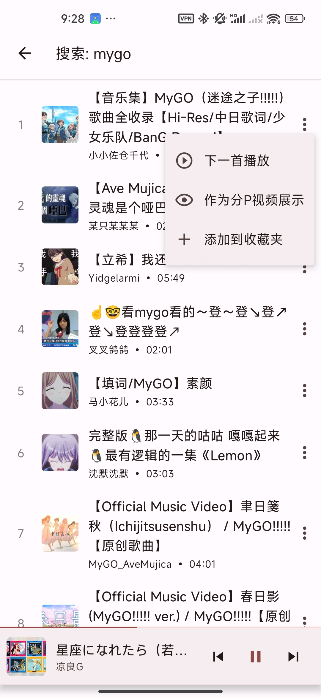

# BBPlayer

一个使用 React Native 构建的 Bilibili 音频播放器。可以更舒服的听歌，而不必使用臃肿的 Bilibili 客户端。

## 屏幕截图

|                  首页                  |                   播放器                   |                    播放列表                    |                    搜索                    |
| :------------------------------------: | :----------------------------------------: | :--------------------------------------------: | :----------------------------------------: |
|  |  |  |  |

## 主要功能

- **Bilibili 登录**: 支持通过扫码或手动设置 Cookie 登录。
- **播放源**:
  - 收藏夹
  - 合集与追更
  - 多P视频 (通过创建以 `[mp]` 为开头命名的收藏夹)
  - UP 主投稿
- **全功能播放器**: 提供播放/暂停、循环、随机、播放队列等功能。
- **搜索**: 可搜索 Bilibili 全站视频或仅在个人收藏中搜索。

## 技术栈

- **框架**: React Native, Expo
- **状态管理**: Zustand
- **数据请求**: React Query
- **UI**: Material Design 3 (React Native Paper)
- **播放库**: React Native Track Player

## 下一步计划（v1）

当前整个软件完全在线（所有数据都来源于 Bilibili，无本地存储），导致很多功能受限于 Bilibili api，下一步计划使用 Drizzle ORM + SQLite 拓展本地存储功能，详细进展可见：<https://github.com/yanyao2333/BBPlayer/pull/15>

## 开源许可

本项目采用 MIT 许可。
