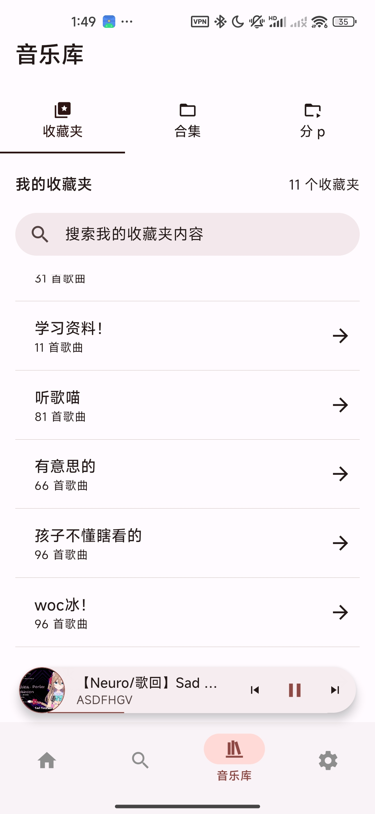

<h1>BBPlayer</h1>

一款使用 React Native 构建的本地优先的 Bilibili 音频播放器。更轻量 & 舒服的听歌体验，远离臃肿卡顿的 Bilibili 客户端。

## 屏幕截图（老版本的）

|                  首页                  |                   播放器                   |                    播放列表                    |                    搜索                    |                    库页面                    |
| :------------------------------------: | :----------------------------------------: | :--------------------------------------------: | :----------------------------------------: | :------------------------------------------: |
|  |  |  |  |  |

## 主要功能

- **Bilibili 登录**: 支持通过扫码或手动设置 Cookie 登录。
- **播放源**: 自由添加本地播放列表，登录账号后也可直接访问账号内收藏夹、订阅合集等，兼顾快速与方便。
- **全功能播放器**: 提供播放/暂停、循环、随机、播放队列等功能。
- **搜索**: 智能搜索，随意一条链接或 b23.tv 短链，即可解析实际内容并展示。同时也有收藏夹和本地播放列表内搜索。

## 技术栈

- **框架**: React Native, Expo
- **状态管理**: Zustand
- **数据请求**: React Query
- **UI**: Material Design 3 (React Native Paper)
- **播放库**: React Native Track Player
- **ORM**: Drizzle ORM

## 开源许可

本项目采用 MIT 许可。

## 错误上报与隐私

- 使用 Sentry 进行错误上报，可能会在异常发生时记录少量与 B 站相关的上下文信息（例如相关的视频标题、bvid 等），用于快速定位问题。
- 不会包含可反查或追溯到具体用户的身份信息；已关闭默认 PII 采集（sendDefaultPii=false），因此不会上传其他个人信息。
- 目前这方面实现较为粗略，欢迎 review 相关代码并就隐私保护提出意见或 PR。
- 支持关闭 Sentry：在设置中关闭错误上报后将不再上传任何信息。
